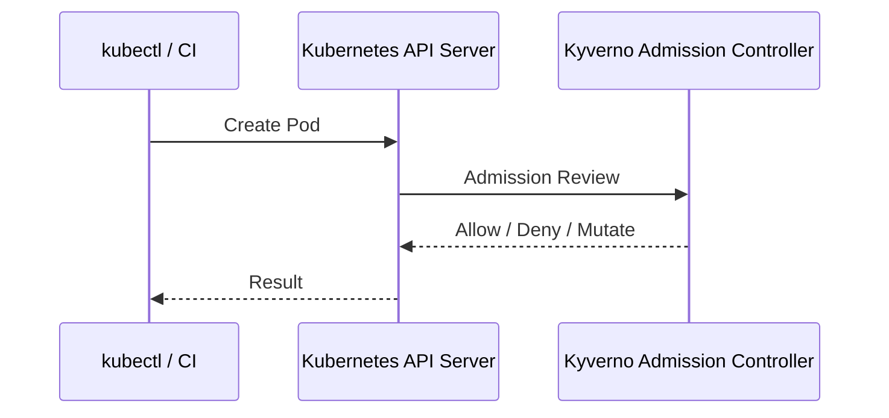
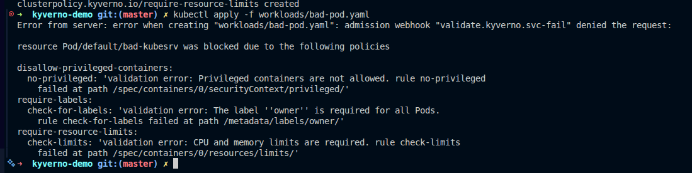
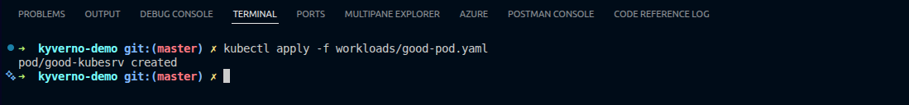
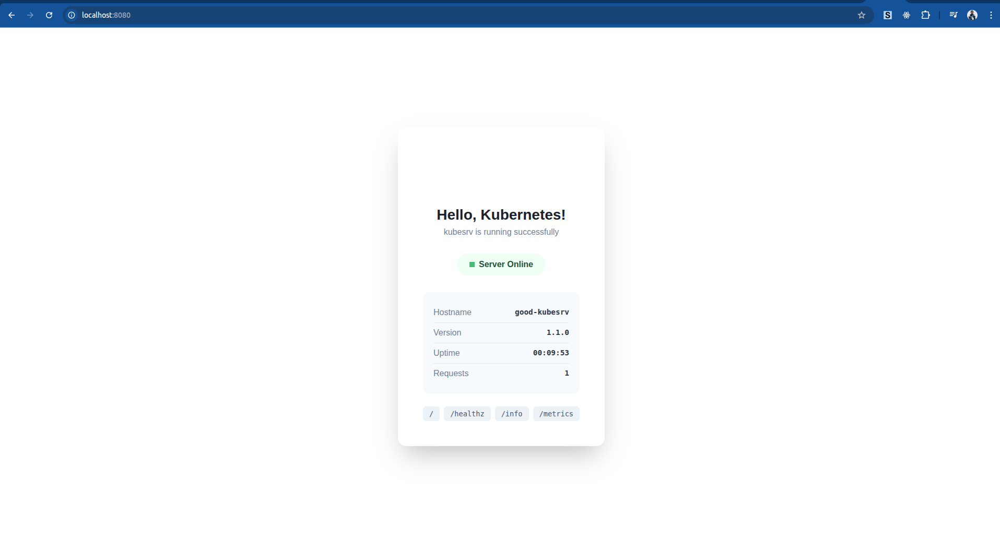

# Kyverno Without the Noise: Practical Kubernetes Policies for Security & Best Practices

How to introduce guardrails in Kubernetes using native YAML — without slowing teams down.

## Introduction

Kubernetes gives teams a lot of power. Too much power, sometimes. One `privileged: true` or missing resource limit can quietly turn into a security incident or a production outage.

That's where Kyverno comes in.

This article is not a full Kyverno manual. Instead, it's a guided introduction: why Kyverno exists, how it fits into Kubernetes, and a few concrete security-focused examples to get you started. If it clicks, you can go deeper using the official docs.

## What is Kyverno — and why should you care?

Kyverno is a Kubernetes-native policy engine. It lets you define rules for your cluster using plain YAML, the same format you already use for Deployments, Services, and Ingresses.

- No new language
- No external policy service  
- No complex tooling

If Kubernetes understands YAML, Kyverno understands your policy.

## Why Kubernetes needs policy enforcement

Kubernetes validates syntax, not intent.

That means Kubernetes will happily accept:

- Pods running as root
- Containers without memory limits
- Images pulled from untrusted registries
- Inconsistent labels and annotations

In real clusters — especially multi-team ones — these are not edge cases. They're normal.

**Policies turn expectations into guarantees.**

## Where Kyverno fits in the Kubernetes lifecycle

Kyverno runs as an admission controller. Every time someone tries to create, update, or delete a resource, Kyverno gets a chance to inspect it.

It can:

- **Validate** it (allow or deny)
- **Mutate** it (fix or enhance it)
- **Generate** other resources
- **Audit** it (report without blocking)

### Admission flow (simplified)



This happens before anything is stored in etcd.

## Policies as YAML — and why that matters

Most policy engines introduce a new DSL. Kyverno doesn't.

A Kyverno policy looks like a Kubernetes resource:

- `apiVersion`
- `kind`
- `metadata`
- `spec`

That means:

- Developers can read policies
- Platform teams can review them
- GitOps tools can manage them
- Policies feel like part of the cluster — not an add-on

## The main types of Kyverno policies (quick tour)

Kyverno supports several policy types. You don't need all of them on day one.

### 1. Validation policies
Block configurations that don't meet your rules.

*"This should never be allowed."*

### 2. Mutation policies
Automatically fix or enhance resources.

*"If it's missing, add it for them."*

### 3. Generation policies
Create related resources automatically.

*"If this exists, make sure that exists too."*

### 4. Image verification policies
Ensure images are trusted and signed.

*"Only run what we trust."*

## Prerequisites

You'll need a Kubernetes cluster to follow along. Choose one:

- **Minikube:** `minikube start`
- **KodeKloud Playground:** [playground.kodekloud.com](https://playground.kodekloud.com)
- **Kind, k3s, or any Kubernetes cluster**

## Installation

### Install Kyverno

Multiple installation options:

**Option 1: Direct YAML (recommended for testing)**
```bash
kubectl create -f https://github.com/kyverno/kyverno/releases/latest/download/install.yaml
```

**Option 2: Helm**
```bash
helm repo add kyverno https://kyverno.github.io/kyverno/
helm install kyverno kyverno/kyverno -n kyverno --create-namespace
```

**Option 3: Kustomize**
```bash
kubectl apply -k https://github.com/kyverno/kyverno/config/default
```

### Get the Demo Repository

```bash
git clone https://github.com/bansikah22/kyverno-demo.git
cd kyverno-demo
```

## Demo time: 3 practical Kyverno scenarios

All examples below are ready-to-run and intentionally minimal.

### Scenario 1: Block privileged containers

Running privileged containers is one of the fastest ways to break your security model.

**Policy: deny privileged Pods**

```yaml
apiVersion: kyverno.io/v1
kind: ClusterPolicy
metadata:
  name: disallow-privileged-containers
spec:
  validationFailureAction: Enforce
  rules:
    - name: no-privileged
      match:
        resources:
          kinds:
            - Pod
      validate:
        message: "Privileged containers are not allowed"
        pattern:
          spec:
            containers:
              - securityContext:
                  privileged: false
```

**Result:** the Pod never reaches the cluster.

### Scenario 2: Enforce resource requests and limits

Missing resource limits are a classic reliability problem.

**Policy: require CPU & memory limits**

```yaml
apiVersion: kyverno.io/v1
kind: ClusterPolicy
metadata:
  name: require-resource-limits
spec:
  validationFailureAction: Enforce
  rules:
    - name: check-limits
      match:
        resources:
          kinds:
            - Pod
      validate:
        message: "CPU and memory limits are required"
        pattern:
          spec:
            containers:
              - resources:
                  limits:
                    cpu: "?*"
                    memory: "?*"
```

This turns best practices into cluster rules, not documentation.

### Scenario 3: Let Kyverno fix things automatically

Blocking is good. Helping is better.

**Policy: inject a default securityContext**

```yaml
apiVersion: kyverno.io/v1
kind: ClusterPolicy
metadata:
  name: add-security-context
spec:
  rules:
    - name: add-non-root
      match:
        resources:
          kinds:
            - Pod
      mutate:
        patchStrategicMerge:
          spec:
            securityContext:
              runAsNonRoot: true
```

Developers don't change anything — the cluster becomes safer by default.

## Audit vs Enforce: adopting Kyverno safely

Kyverno doesn't force you to go all-in.

You can start in **Audit** mode:
- Policies report violations
- No workloads are blocked

Then move to **Enforce** when teams are ready.

This makes Kyverno realistic for existing clusters.

## When Kyverno shines — and when it doesn't

### Kyverno is excellent when:
- You want Kubernetes-native policies
- You value readability and YAML
- You enforce platform and security standards

### Kyverno is not:
- A runtime security tool
- A replacement for vulnerability scanners
- A general-purpose policy engine outside Kubernetes

Knowing this avoids misuse.


## Where to go next

If Kyverno makes sense so far:

- Explore more policy examples in the [official policy library](https://kyverno.io/policies/)
- Look into image verification and supply-chain security
- Try combining Kyverno with GitOps workflows

Kyverno doesn't try to do everything — it does policy enforcement the Kubernetes way.

And that's exactly why it works.

## Hands-on Testing

Now let's test everything together:

### 1. Apply the policies
```bash
kubectl apply -f policies/
```

### 2. Test policy enforcement

**Try the bad pod (should be rejected):**
```bash
kubectl apply -f workloads/bad-pod.yaml
# Expected: Error - privileged containers not allowed
```


**Deploy the good pod (should succeed):**
```bash
kubectl apply -f workloads/good-pod.yaml
# Expected: Pod created successfully
```


**Deploy production workload:**
```bash
kubectl apply -f workloads/kubesrv-deployment.yaml
# Expected: Deployment and service created
```

### 3. Verify the results

```bash
# Check pods
kubectl get pods

# Test the service (use port 8080 to avoid permission issues)
kubectl port-forward svc/kubesrv-service 8080:8080

# In another terminal, test with curl
curl http://localhost:8080

## or visit browser with http://localhost:8080 and you will se 
```


### 4. Check policy reports

```bash
# View policy violations
kubectl get cpol
kubectl describe cpol disallow-privileged-containers
```

---

*If you enjoyed this introduction, the official Kyverno documentation is the best next stop. This article is just the beginning.*